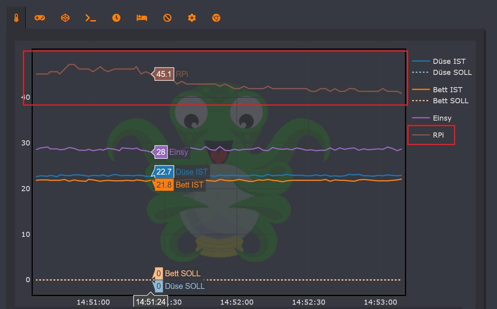

# OctoPrint-RPiCPUTempGraph

A simple OctoPrint plugin that adds the Raspberry Pi's CPU temperature to [Plotly Temp Graph](https://github.com/jneilliii/OctoPrint-PlotlyTempGraph) by [jneilliii](https://github.com/jneilliii). Without Plotly Temp Graph this plugin won't do anything.

Based on https://github.com/jneilliii/OctoPrint-PlotlyTempGraph/blob/master/test%20plotly%20graph.py

## Setup

* **Octoprint plugin manager:** Install the plugin through `Plugin Manager > + More > ...from URL >` 

	https://raw.githubusercontent.com/CMR-DEV/OctoPrint-RPiCPUTempGraph/main/main.py

* **OctoPrint-PlotlyTempGraph plugin settings:** Select `RPiCPU actual` in the name mapping and set any label and color you want.
